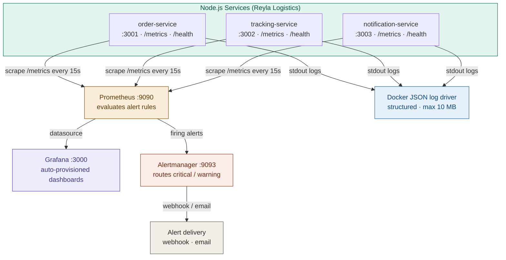

# WatchTower — Reyla Logistics Observability Stack

This repository contains the completed observability challenge for Reyla Logistics. The three existing backend services (order, tracking, and notification) are wired up with a full monitoring stack using Prometheus, Grafana, and Alertmanager — so the team can see what is happening inside their system at any time, and get notified before customers do.

## Table of Contents
- [Architecture Diagram](#architecture-diagram)
- [Setup Instructions](#setup-instructions)
- [Dashboard Walkthrough](#dashboard-walkthrough)
- [Alert Testing Guide](#alert-testing-guide)
- [Log Commands](#log-commands)
- [Bonus — Alertmanager](#bonus--alertmanager-webhook-routing)
- [Repository Structure](#repository-structure)

---

## Architecture Diagram



**Data flows:**
- Each service exposes a `/metrics` endpoint in Prometheus format. Prometheus scrapes all three every 15 seconds.
- Prometheus evaluates alert rules continuously. When a rule fires, it forwards the alert to Alertmanager.
- Alertmanager deduplicates and routes alerts to the configured webhook or email receiver.
- Grafana reads from Prometheus as its data source and renders the pre-built dashboard automatically on startup via provisioning — no manual import required.
- All service stdout is captured by Docker's JSON log driver, structured and capped at 10 MB per file.

---

## Setup Instructions

### Prerequisites

- [Docker](https://docs.docker.com/get-docker/) and [Docker Compose](https://docs.docker.com/compose/install/) installed
- Ports 3001, 3002, 3003, 9090, 9093, and 3000 free on your machine

### 1. Clone the repository

```bash
git clone https://github.com/YOUR_USERNAME/watchtower.git
cd watchtower
```

### 2. Configure environment variables

```bash
cp app/.env.example app/.env
```

The defaults in `.env.example` work out of the box for local development. Open the file if you want to change passwords or port numbers.

### 3. Start the full stack

```bash
cd app
docker compose up --build -d
```

This starts all three services, Prometheus, Grafana, and Alertmanager in one command.

### 4. Verify everything is running

| Service | URL | What to check |
|---|---|---|
| order-service | http://localhost:3001/health | Returns `{ "status": "ok" }` |
| tracking-service | http://localhost:3002/health | Returns `{ "status": "ok" }` |
| notification-service | http://localhost:3003/health | Returns `{ "status": "ok" }` |
| Prometheus | http://localhost:9090/targets | All three services show **UP** in green |
| Grafana | http://localhost:3000 | Dashboard loads automatically (login: `admin` / `reyla2024!`) |
| Alertmanager | http://localhost:9093 | UI is accessible, no active alerts at startup |

### 5. Stop the stack

```bash
docker compose down
```

To also remove volumes (wipes Grafana and Prometheus data):

```bash
docker compose down -v
```

---

## Dashboard Walkthrough

The Grafana dashboard loads automatically at http://localhost:3000 when the stack starts. No manual import steps are needed — this is handled via Grafana provisioning (`grafana/provisioning/`).

### Panel 1 — Service health status

Three stat panels, one per service. Each queries the `up` metric from Prometheus:
- `up{job="order-service"}`
- `up{job="tracking-service"}`
- `up{job="notification-service"}`

A value of `1` renders as a green **UP**. A value of `0` renders as a red **DOWN**. This gives the team an instant at-a-glance answer to "is everything running?" without needing to open a terminal.

### Panel 2 — HTTP request rate

A time-series line chart showing requests per second for each service over the last hour:

```
rate(http_requests_total[1m])
```

One line per service (grouped by `job` label). This panel helps the team spot traffic spikes, unexpected drops, or a service receiving zero traffic — all of which can indicate a problem before errors start appearing.

### Panel 3 — 5xx error rate

A time-series line chart tracking the rate of server-side errors per service over a 5-minute window:

```
rate(http_requests_total{status=~"5.."}[5m])
```

This panel connects directly to the `HighErrorRate` alert — if any line on this chart climbs above 5% of total traffic, an alert will fire. It makes the alert condition visible before it becomes a notification.

### Panel 4 — P95 response latency

Tracks the 95th percentile response time per service:

```
histogram_quantile(0.95, rate(http_request_duration_seconds_bucket[5m]))
```

> **Note:** The current services use basic counters and do not expose a histogram metric, so this panel will show "No data" until histogram instrumentation is added to the Express apps. The panel is included to make it easy to enable once the services are updated.

### Panel 5 — Total request count

Stat panels showing the cumulative total requests received per service:

```
sum(http_requests_total) by (job)
```

Useful for capacity planning and for confirming that load is distributed as expected across services.

---

## Alert Testing Guide

All three alert rules are defined in `app/prometheus/alerts.yml` and loaded automatically by Prometheus. You can view the current alert state at any time at http://localhost:9090/alerts.

### Alert 1 — ServiceDown (severity: critical)

**Condition:** Any service's `/health` endpoint returns non-200 for more than 1 minute.

**How to test:**

```bash
# Stop one service
docker compose stop order-service

# Wait ~60 seconds, then check the alerts page
open http://localhost:9090/alerts
```

The `ServiceDown` alert will move from **Pending** to **Firing** after 1 minute. Alertmanager will receive the alert and route it to the configured webhook receiver. You can confirm delivery at http://localhost:9093.

**To resolve:** Restart the service and the alert will automatically resolve.

```bash
docker compose start order-service
```

---

### Alert 2 — HighErrorRate (severity: warning)

**Condition:** More than 5% of requests result in 5xx errors over a 5-minute window.

**How to test:**

The services do not generate 5xx errors naturally. To trigger this alert, you can send requests to an endpoint that does not exist (which some frameworks return as 500) or temporarily inject an error route into the service for testing:

```bash
# Send 100 requests that will return errors (adjust the URL to match your service behaviour)
for i in $(seq 1 100); do curl -s http://localhost:3001/force-error > /dev/null; done
```

Wait 5 minutes and check http://localhost:9090/alerts. If the error rate exceeds 5% of total traffic over that window, the alert will fire.

> **Note:** Because the apps handle unknown routes gracefully (often returning 404 rather than 500), the most reliable way to test this in a real environment would be to temporarily modify the service to return 500 on a specific route and send traffic to it, then revert.

---

### Alert 3 — ServiceNotScraping (severity: warning)

**Condition:** Prometheus has not received metrics from a service for more than 2 minutes.

**How to test:**

This alert fires when Prometheus cannot reach a service's `/metrics` endpoint at all — which happens naturally when you stop a service:

```bash
docker compose stop tracking-service
```

Wait 2–4 minutes. Check http://localhost:9090/alerts — you will see both `ServiceDown` and `ServiceNotScraping` fire for the stopped service. The `ServiceNotScraping` alert specifically fires when the time series goes fully stale (no data at all), which is distinct from a service returning errors.

**To resolve:**

```bash
docker compose start tracking-service
```

---

## Log Commands

The `docker-compose.yml` configures Docker to use the `json-file` log driver on all app services, writing structured logs capped at 10 MB per file (3 files max per service before rotation).

### View live logs from all services at once

```bash
docker compose logs -f order-service tracking-service notification-service
```

Example output:

```
order-service        | {"level":"info","service":"order-service","msg":"Server started","port":3001}
tracking-service     | {"level":"info","service":"tracking-service","msg":"Server started","port":3002}
notification-service | {"level":"info","service":"notification-service","msg":"Server started","port":3003}
order-service        | {"level":"info","service":"order-service","msg":"GET /health","status":200,"duration_ms":2}
```

### Filter logs to show only errors from a specific service

```bash
docker compose logs order-service 2>&1 | grep '"level":"error"'
```

Example output:

```
order-service | {"level":"error","service":"order-service","msg":"Unhandled exception","stack":"Error: ..."}
```

> If no errors have occurred, this command returns no output — which is the expected result on a healthy service.

---

## Bonus — Alertmanager webhook routing

Alertmanager has been added to the stack as a bonus feature. It is configured in `app/alertmanager/alertmanager.yml` and receives all firing alerts from Prometheus.

**What it does:**
- `severity: critical` alerts (such as `ServiceDown`) are routed to a webhook receiver. In production, this would point to a Slack incoming webhook, PagerDuty, or a similar on-call tool. For local testing, the placeholder URL is set to https://webhook.site, which lets you inspect incoming payloads in a browser.
- `severity: warning` alerts are grouped and sent after a 5-minute delay to avoid noise from transient issues.

**Why this was added:** In a real last-mile delivery operation like Reyla's, a `ServiceDown` alert needs to wake someone up immediately — not sit in a dashboard waiting to be noticed. Alertmanager provides the routing, grouping, and silencing logic to make that possible without flooding the team with duplicate notifications.

---

## Repository structure

```
watchtower/
├── app/
│   ├── docker-compose.yml
│   ├── .env.example
│   ├── order-service/
│   ├── tracking-service/
│   ├── notification-service/
│   ├── prometheus/
│   │   ├── prometheus.yml
│   │   └── alerts.yml
│   ├── alertmanager/
│   │   └── alertmanager.yml
│   └── grafana/
│       ├── provisioning/
│       │   ├── datasources/
│       │   │   └── prometheus.yml
│       │   └── dashboards/
│       │       └── dashboard.yml
│       └── dashboards/
│           └── reyla-overview.json
└── README.md
```